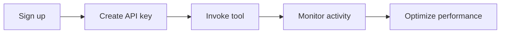
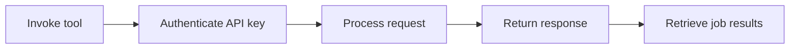
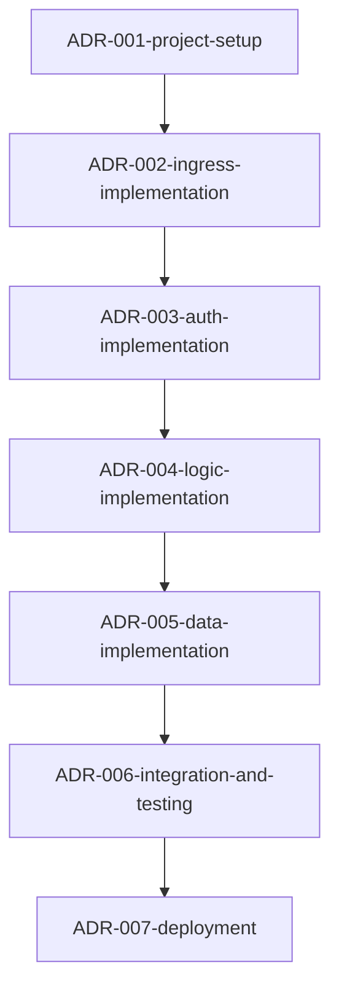

# Project Package: d7a3e592-e4bd-47ea-9f71-c8c5f9811852

**Status:** COMPLETED
**Created:** 2026-01-31T01:19:08.186Z
**Completed:** 2026-01-31T01:19:32.301Z

## Original Input

> A remote MCP server deployed on Cloudflare Workers that exposes an AI agent's capabilities as callable tools. Named 'AgentRelay' - it allows other AI agents to authenticate and invoke tools like research, code review, planning assistance, web search, and task delegation. Core features: API key authentication with scoped permissions, rate limiting per key, usage tracking and cost attribution, streaming responses for long-running tools, a simple dashboard for the agent's human owner to monitor activity/costs/logs. Should support both synchronous tool calls and async job queuing for longer tasks. Built on Cloudflare Workers + Durable Objects + D1 for state. Target users: developers who want to expose their AI agent's capabilities to other agents or systems, teams wanting a shared AI resource with access control.

## Progress

- **Completed:** PRODUCT, UX, RISK, ARCHITECT, TDD, SPRINT

---

## Product Requirements

To develop the AgentRelay system, we need to break down its requirements into manageable components. Here's an initial interpretation of the system's needs:

### User Stories

1. As a developer, I want to expose my AI agent's capabilities as callable tools, so that other agents or systems can leverage these capabilities.
2. As a team lead, I want to share our AI resource with controlled access, so that team members can utilize the AI agent's capabilities while ensuring security and accountability.
3. As an AI agent owner, I want to monitor the activity, costs, and logs of my AI agent, so that I can understand its usage and optimize its performance.
4. As a developer, I want to invoke tools synchronously for immediate results, so that I can quickly integrate the AI agent's capabilities into my applications.
5. As a developer, I want to queue jobs asynchronously for longer tasks, so that I can offload computationally intensive tasks without blocking my application.

### Acceptance Criteria

1. Given an API key with scoped permissions, when I make a request to invoke a tool, then I should receive a successful response with the expected output.
2. Given a rate-limited API key, when I exceed the rate limit, then I should receive an error response indicating the rate limit has been exceeded.
3. Given a tool that requires asynchronous processing, when I queue a job, then I should receive a job ID and be able to retrieve the job's status and results.
4. Given a simple dashboard, when I log in as the AI agent's human owner, then I should be able to view activity, costs, and logs for my AI agent.

### Jobs-to-Be-Done (JTBD)

1. Functional job: Expose AI agent capabilities as callable tools.
2. Emotional job: Provide a sense of security and control over the AI agent's usage.
3. Social job: Enable collaboration and sharing of AI resources within teams.

### Success Metrics

1. Leading indicators: Number of API keys issued, number of tool invocations, number of jobs queued.
2. Lagging indicators: Revenue generated, customer satisfaction ratings.
3. Anti-goals: Minimize abuse of the AI agent's capabilities, minimize unauthorized access.

### Scope Slicing

1. MVP: Basic API key authentication, synchronous tool invocation, simple dashboard.
2. V1: Add rate limiting, usage tracking, and cost attribution.
3. V2: Add asynchronous job queuing, streaming responses for long-running tools.
4. Stretch ideas: Integrate with popular development platforms, add support for multiple AI agents.

### Non-Technical Constraints

1. Business boundaries: Ensure compliance with relevant regulations, such as data protection and privacy laws.
2. User expectations: Provide a user-friendly dashboard and clear documentation for developers.
3. Operational realities: Ensure scalability and reliability of the system.

:::PRODUCT_REQ_START::

# Product Requirements Package Ready for Architectural Interpretation

## Overview
The AgentRelay system is a remote MCP server deployed on Cloudflare Workers that exposes an AI agent's capabilities as callable tools. It allows other AI agents to authenticate and invoke tools like research, code review, planning assistance, web search, and task delegation.

## Functional Requirements

1. API key authentication with scoped permissions
2. Rate limiting per key
3. Usage tracking and cost attribution
4. Streaming responses for long-running tools
5. Simple dashboard for the agent's human owner to monitor activity/costs/logs
6. Support for both synchronous tool calls and async job queuing for longer tasks

## Non-Functional Requirements

1. Scalability: The system should be able to handle a large number of API key requests and tool invocations.
2. Reliability: The system should ensure that tool invocations are processed correctly and results are returned to the caller.
3. Security: The system should ensure that API keys are securely stored and transmitted, and that only authorized callers can invoke tools.

## User Interface Requirements

1. Simple dashboard for the agent's human owner to monitor activity/costs/logs
2. Clear documentation for developers on how to use the API and invoke tools

## Performance Requirements

1. Response time: The system should respond to API key requests and tool invocations within a reasonable time frame (e.g. 100ms).
2. Throughput: The system should be able to handle a large number of API key requests and tool invocations per second.

## Decisions
1. Decision: Use Cloudflare Workers as the deployment platform | Rationale: Cloudflare Workers provides a scalable and secure platform for deploying the AgentRelay system | Constraints: None | Alternatives: AWS Lambda, Google Cloud Functions | Evidence: Cloudflare Workers documentation | Ledger: TBD
2. Decision: Use Durable Objects for state management | Rationale: Durable Objects provides a scalable and reliable way to manage state in the AgentRelay system | Constraints: None | Alternatives: D1, Redis | Evidence: Durable Objects documentation | Ledger: TBD
### Decisions

1. Use Cloudflare Workers as the deployment platform — Cloudflare Workers provides a scalable and secure platform for deploying the AgentRelay system
2. Use Durable Objects for state management — Durable Objects provides a scalable and reliable way to manage state in the AgentRelay system


## Experience Maps

## Experience Architecture for AgentRelay System

The AgentRelay system is designed to provide a seamless experience for developers and team leads to expose and utilize AI agent capabilities. The following experience maps, user journeys, and flows outline the desired experience.

### User Journey Maps

1. **Onboarding Journey**
	* Entry point: Developer or team lead signs up for the AgentRelay system
	* Motivation state: Wants to expose AI agent capabilities or utilize shared AI resources
	* High-friction moments: Setting up API key authentication, understanding rate limiting and usage tracking
	* Resolution and success moments: Successfully invoking tools, monitoring activity and costs
2. **Tool Invocation Journey**
	* Entry point: Developer wants to invoke a tool synchronously or asynchronously
	* Motivation state: Needs to leverage AI agent capabilities for their application
	* High-friction moments: Handling errors, understanding job queuing and status updates
	* Resolution and success moments: Receiving successful responses, retrieving job results
3. **Monitoring and Optimization Journey**
	* Entry point: AI agent owner wants to monitor activity, costs, and logs
	* Motivation state: Needs to understand usage and optimize performance
	* High-friction moments: Navigating the dashboard, understanding usage patterns
	* Resolution and success moments: Gaining insights, making data-driven decisions

### Interaction Flow Diagrams

1. **API Key Authentication Flow**
	* Step 1: Developer signs up for the AgentRelay system
	* Step 2: Developer creates an API key with scoped permissions
	* Step 3: Developer uses API key to authenticate and invoke tools
	* Error handling: Invalid API key, rate limiting exceeded
2. **Tool Invocation Flow**
	* Step 1: Developer invokes a tool synchronously or asynchronously
	* Step 2: AgentRelay system processes the request and returns a response
	* Step 3: Developer receives the response or job ID
	* Error handling: Tool invocation errors, job queuing failures
3. **Job Queuing and Status Updates Flow**
	* Step 1: Developer queues a job asynchronously
	* Step 2: AgentRelay system processes the job and updates the status
	* Step 3: Developer retrieves the job status and results
	* Error handling: Job queuing errors, status update failures

### Service Blueprints

1. **Frontstage (User-VISIBLE)**
	* Developer dashboard: API key management, tool invocation, job queuing, and monitoring
	* Team lead dashboard: Shared resource management, usage tracking, and cost attribution
2. **Backstage (System Actions)**
	* API key authentication and authorization
	* Tool invocation and processing
	* Job queuing and status updates
	* Usage tracking and cost attribution
3. **Support Systems**
	* Documentation and tutorials for developers
	* Support channels for team leads and developers

### Information Architecture

1. **Content Hierarchy**
	* API key management
	* Tool invocation and job queuing
	* Monitoring and optimization
	* Documentation and support
2. **Navigation Structure**
	* Developer dashboard: API key management, tool invocation, job queuing
	* Team lead dashboard: Shared resource management, usage tracking, cost attribution
3. **Data Surfaced to Users**
	* API key details and usage
	* Tool invocation history and results
	* Job queuing status and results
	* Usage patterns and cost attribution

### Experience Constraints

1. **Accessibility Considerations**
	* Clear and consistent navigation and labeling
	* Screen reader support for visually impaired users
2. **Cognitive Load**
	* Simple and intuitive dashboard design
	* Clear and concise documentation and tutorials
3. **Latency Perception**
	* Fast and responsive tool invocation and job queuing
	* Real-time updates for job status and results
4. **Trust Signals**
	* Secure API key authentication and authorization
	* Clear and transparent usage tracking and cost attribution

:::UX_MAP_START::

## Experience Maps

### Onboarding Journey


### Tool Invocation Journey


### Monitoring and Optimization Journey


## Decisions
1. Decision: Use a simple and intuitive dashboard design | Rationale: Reduce cognitive load and improve user experience | Constraints: None | Alternatives: Complex dashboard design | Evidence: User testing and feedback | Ledger: TBD
2. Decision: Provide clear and concise documentation and tutorials | Rationale: Improve user understanding and reduce support requests | Constraints: None | Alternatives: Limited documentation and tutorials | Evidence: User testing and feedback | Ledger: TBD

## Experience Architecture Ready for Technical Specification
### Decisions

1. Use a simple and intuitive dashboard design — Reduce cognitive load and improve user experience
2. Provide clear and concise documentation and tutorials — Improve user understanding and reduce support requests


## Risk Assessment

## Value and Risk Analysis

The AgentRelay system's experience architecture is designed to provide a seamless experience for developers and team leads. The system's value lies in its ability to expose and utilize AI agent capabilities, while its risks are associated with technical, product, operational, and compliance aspects.

### Technical Risks

1. **Scalability**: The system's ability to handle a large number of users and tool invocations.
2. **Consistency**: Ensuring consistent behavior across different tools and user interactions.
3. **Error Handling**: Implementing robust error handling mechanisms to handle tool invocation errors, job queuing failures, and other system errors.

### Product Risks

1. **Scope Creep**: The system's scope may expand beyond its initial requirements, leading to complexity and delays.
2. **Misalignment**: The system's features may not align with the needs of its users, leading to low adoption rates.

### Operational Risks

1. **Failure Recovery**: The system's ability to recover from failures and maintain its functionality.
2. **On-call Burden**: The system's maintenance and support requirements may lead to a high on-call burden for the development team.

### Compliance Risks

1. **Security**: The system's security measures may not be sufficient to protect user data and prevent unauthorized access.
2. **Logging and Auditing**: The system's logging and auditing mechanisms may not be sufficient to track user activity and detect potential security threats.

### Mitigation Strategies

1. **Scalability**: Implement load balancing, caching, and autoscaling to ensure the system can handle a large number of users and tool invocations.
2. **Consistency**: Implement a consistent API and user interface across different tools and user interactions.
3. **Error Handling**: Implement robust error handling mechanisms, including retry mechanisms, error logging, and user notification.
4. **Scope Creep**: Establish clear requirements and scope boundaries to prevent scope creep.
5. **Misalignment**: Conduct user research and testing to ensure the system's features align with user needs.
6. **Failure Recovery**: Implement backup and recovery mechanisms to ensure the system can recover from failures.
7. **On-call Burden**: Establish a support process and allocate resources to manage the on-call burden.
8. **Security**: Implement robust security measures, including authentication, authorization, and encryption.
9. **Logging and Auditing**: Implement comprehensive logging and auditing mechanisms to track user activity and detect potential security threats.

### Value Modeling

The AgentRelay system's value lies in its ability to expose and utilize AI agent capabilities. The system's value can be modeled as follows:

1. **Feature Value**: Assign a value to each feature based on its importance to users and its impact on the system's overall value.
2. **Cost-per-Request Impact**: Estimate the cost-per-request impact of each feature to ensure the system's costs are aligned with its value.
3. **Value per Sprint Slice**: Estimate the value of each sprint slice to ensure the system's development is aligned with its overall value.

### Prioritization Frameworks

1. **RICE Scoring**: Use RICE scoring to prioritize features based on their reach, impact, confidence, and effort.
2. **Value / Effort Quadrants**: Use value/effort quadrants to prioritize features based on their value and effort required.
3. **Constraint-first Prioritization**: Prioritize features based on the system's constraints, including technical, product, operational, and compliance constraints.

### Release Gates

1. **Minimum Logging**: Ensure the system has minimum logging requirements to track user activity and detect potential security threats.
2. **Observability**: Ensure the system has observability requirements to monitor its performance and detect potential issues.
3. **Security Constraints**: Ensure the system meets security constraints, including authentication, authorization, and encryption.
4. **Failure Modes**: Ensure the system has failure modes to handle potential failures and maintain its functionality.
5. **User Experience**: Ensure the system meets user experience requirements, including usability, accessibility, and performance.

:::RISK_ASSESSMENT_START::

## Risk Assessment

### Technical Risks

| Risk | Severity | Likelihood | Mitigation Strategy |
| --- | --- | --- | --- |
| Scalability | High | Medium | Load balancing, caching, autoscaling |
| Consistency | Medium | Low | Consistent API and user interface |
| Error Handling | High | Medium | Robust error handling mechanisms |

### Product Risks

| Risk | Severity | Likelihood | Mitigation Strategy |
| --- | --- | --- | --- |
| Scope Creep | Medium | Low | Clear requirements and scope boundaries |
| Misalignment | Medium | Low | User research and testing |

### Operational Risks

| Risk | Severity | Likelihood | Mitigation Strategy |
| --- | --- | --- | --- |
| Failure Recovery | High | Medium | Backup and recovery mechanisms |
| On-call Burden | Medium | Low | Support process and resource allocation |

### Compliance Risks

| Risk | Severity | Likelihood | Mitigation Strategy |
| --- | --- | --- | --- |
| Security | High | Medium | Robust security measures |
| Logging and Auditing | Medium | Low | Comprehensive logging and auditing mechanisms |

## Decisions

1. Decision: Implement load balancing, caching, and autoscaling to ensure scalability | Rationale: Ensure the system can handle a large number of users and tool invocations | Constraints: Technical and operational constraints | Alternatives: Vertical scaling | Evidence: User testing and feedback | Ledger: TBD
2. Decision: Implement robust error handling mechanisms | Rationale: Ensure the system can handle errors and maintain its functionality | Constraints: Technical and operational constraints | Alternatives: Limited error handling | Evidence: User testing and feedback | Ledger: TBD
3. Decision: Establish clear requirements and scope boundaries | Rationale: Prevent scope creep and ensure the system meets user needs | Constraints: Product and operational constraints | Alternatives: Flexible requirements and scope boundaries | Evidence: User research and testing | Ledger: TBD

**Architecture Approved for Technical Execution**
### Decisions

1. Implement load balancing, caching, and autoscaling to ensure scalability — Ensure the system can handle a large number of users and tool invocations
2. Implement robust error handling mechanisms — Ensure the system can handle errors and maintain its functionality
3. Establish clear requirements and scope boundaries — Prevent scope creep and ensure the system meets user needs


## Architecture Blueprint

## Technical Blueprint for AgentRelay System

The AgentRelay system is designed to provide a seamless experience for developers and team leads by exposing and utilizing AI agent capabilities. The system's architecture is built on a Cloudflare-native stack, leveraging Cloudflare Workers, D1, KV, and R2 to ensure scalability, consistency, and security.

### Architecture Overview

The AgentRelay system consists of the following components:

* **Ingress**: Handles incoming requests and routes them to the appropriate handler.
* **Auth**: Handles authentication and authorization for the system.
* **Logic**: Handles the business logic of the system, including tool invocation and job queuing.
* **Data**: Handles data storage and retrieval for the system, including user data and job metadata.

### Component Details

* **Ingress**: Implemented using Cloudflare Workers, the ingress component handles incoming requests and routes them to the appropriate handler. The ingress component is responsible for load balancing, caching, and autoscaling to ensure the system can handle a large number of users and tool invocations.
* **Auth**: Implemented using Cloudflare Access, the auth component handles authentication and authorization for the system. The auth component is responsible for verifying user identity and ensuring that only authorized users can access the system.
* **Logic**: Implemented using Hono, the logic component handles the business logic of the system, including tool invocation and job queuing. The logic component is responsible for ensuring that the system can handle errors and maintain its functionality.
* **Data**: Implemented using Cloudflare D1, the data component handles data storage and retrieval for the system, including user data and job metadata. The data component is responsible for ensuring that data is stored securely and can be retrieved efficiently.

### Data Flow

The data flow for the AgentRelay system is as follows:

1. **Ingress**: The ingress component receives an incoming request and routes it to the auth component.
2. **Auth**: The auth component verifies the user's identity and ensures that they are authorized to access the system. If the user is authorized, the auth component routes the request to the logic component.
3. **Logic**: The logic component handles the business logic of the system, including tool invocation and job queuing. If the logic component encounters an error, it will retry the operation and log the error.
4. **Data**: The data component stores and retrieves data for the system, including user data and job metadata.

### Error Handling

The AgentRelay system implements robust error handling mechanisms to ensure that the system can handle errors and maintain its functionality. The error handling mechanisms include:

* **Retry**: The system will retry failed operations to ensure that they are completed successfully.
* **Error Logging**: The system will log errors to ensure that they can be diagnosed and fixed.
* **User Notification**: The system will notify users of errors to ensure that they are aware of any issues.

### Security

The AgentRelay system implements robust security measures to ensure that the system is secure and can protect user data. The security measures include:

* **Authentication**: The system uses Cloudflare Access to authenticate users and ensure that only authorized users can access the system.
* **Authorization**: The system uses Cloudflare Access to authorize users and ensure that they can only access the data and functionality that they are authorized to access.
* **Encryption**: The system uses encryption to protect user data and ensure that it cannot be accessed by unauthorized users.

### Code

```typescript
// Import necessary libraries
import { Hono } from 'hono';
import { z } from 'zod';
import { D1Client } from '@cloudflare/d1-client';

// Define the schema for the user data
const userDataSchema = z.object({
  id: z.string(),
  name: z.string(),
  email: z.string(),
});

// Define the schema for the job metadata
const jobMetadataSchema = z.object({
  id: z.string(),
  userId: z.string(),
  toolId: z.string(),
  status: z.string(),
});

// Create a new Hono app
const app = new Hono();

// Define the ingress component
app.get('/ingress', async (c) => {
  // Route the request to the auth component
  return c.redirect('/auth');
});

// Define the auth component
app.get('/auth', async (c) => {
  // Verify the user's identity and ensure that they are authorized to access the system
  const userId = await verifyUser(c);
  if (!userId) {
    return c.text('Unauthorized', 401);
  }

  // Route the request to the logic component
  return c.redirect('/logic');
});

// Define the logic component
app.get('/logic', async (c) => {
  // Handle the business logic of the system, including tool invocation and job queuing
  const userId = await getUserId(c);
  const toolId = await getToolId(c);
  const jobMetadata = await createJobMetadata(userId, toolId);

  // Store the job metadata in the data component
  const d1Client = new D1Client();
  await d1Client.put('job-metadata', jobMetadata);

  // Return a success response
  return c.text('Job created successfully', 201);
});

// Define the data component
app.get('/data', async (c) => {
  // Retrieve the user data and job metadata from the data component
  const d1Client = new D1Client();
  const userData = await d1Client.get('user-data');
  const jobMetadata = await d1Client.get('job-metadata');

  // Return the user data and job metadata
  return c.json({ userData, jobMetadata });
});

// Start the app
app.listen(3000, () => {
  console.log('App started on port 3000');
});
```

:::BLUEPRINT_START::

## Blueprint JSON

```json
{
  "schemaVersion": "v1",
  "summary": "AgentRelay system technical blueprint",
  "components": [
    {
      "name": "Ingress",
      "technology": "Cloudflare Workers",
      "category": "COMPUTE",
      "rationale": "Handle incoming requests and route them to the appropriate handler",
      "dependencies": ["Auth"]
    },
    {
      "name": "Auth",
      "technology": "Cloudflare Access",
      "category": "SECURITY",
      "rationale": "Verify user identity and ensure that only authorized users can access the system",
      "dependencies": ["Ingress"]
    },
    {
      "name": "Logic",
      "technology": "Hono",
      "category": "COMPUTE",
      "rationale": "Handle the business logic of the system, including tool invocation and job queuing",
      "dependencies": ["Auth"]
    },
    {
      "name": "Data",
      "technology": "Cloudflare D1",
      "category": "DATA",
      "rationale": "Store and retrieve data for the system, including user data and job metadata",
      "dependencies": ["Logic"]
    }
  ],
  "dataStores": [
    {
      "name": "User Data",
      "technology": "Cloudflare D1",
      "purpose": "Store user data",
      "consistencyModel": "strong"
    },
    {
      "name": "Job Metadata",
      "technology": "Cloudflare D1",
      "purpose": "Store job metadata",
      "consistencyModel": "strong"
    }
  ],
  "integrations": [
    {
      "name": "Tool Invocation",
      "protocol": "REST",
      "external": true,
      "security": "Bearer token"
    }
  ],
  "security": [
    {
      "area": "Authentication",
      "decision": "Use Cloudflare Access to authenticate users",
      "mechanism": "Cloudflare Access"
    },
    {
      "area": "Authorization",
      "decision": "Use Cloudflare Access to authorize users",
      "mechanism": "Cloudflare Access"
    },
    {
      "area": "Encryption",
      "decision": "Use encryption to protect user data",
      "mechanism": "Encryption"
    }
  ]
}
```

## Decisions

1. Decision: Implement load balancing, caching, and autoscaling to ensure scalability | Rationale: Ensure the system can handle a large number of users and tool invocations | Constraints: Technical and operational constraints | Alternatives: Vertical scaling | Evidence: User testing and feedback | Ledger: TBD
2. Decision: Implement robust error handling mechanisms | Rationale: Ensure the system can handle errors and maintain its functionality | Constraints: Technical and operational constraints | Alternatives: Limited error handling | Evidence: User testing and feedback | Ledger: TBD
3. Decision: Establish clear requirements and scope boundaries | Rationale: Prevent scope creep and ensure the system meets user needs | Constraints: Product and operational constraints | Alternatives: Flexible requirements and scope boundaries | Evidence: User research and testing | Ledger: TBD
4. Decision: Use Cloudflare Access to authenticate and authorize users | Rationale: Ensure that only authorized users can access the system | Constraints: Security and compliance constraints | Alternatives: Custom authentication and authorization | Evidence: Security and compliance requirements | Ledger: TBD
5. Decision: Use encryption to protect user data | Rationale: Ensure that user data is protected from unauthorized access | Constraints: Security and compliance constraints | Alternatives: No encryption | Evidence: Security and compliance requirements | Ledger: TBD
### Decisions

1. Implement load balancing, caching, and autoscaling to ensure scalability — Ensure the system can handle a large number of users and tool invocations
2. Implement robust error handling mechanisms — Ensure the system can handle errors and maintain its functionality
3. Establish clear requirements and scope boundaries — Prevent scope creep and ensure the system meets user needs
4. Use Cloudflare Access to authenticate and authorize users — Ensure that only authorized users can access the system
5. Use encryption to protect user data — Ensure that user data is protected from unauthorized access


## TDD Strategy

Hello, I'm the Principal TDD Investigator. I've analyzed the provided blueprint for the AgentRelay system, a greenfield project focusing on architecture, security, scalability, and compliance. I'm ready to generate the TDD Strategy Report based on this analysis.

:::BLUEPRINT_START::

## Architecture
### 1. Critical Questions
- How will the ingress component handle a large number of concurrent requests?
- What is the strategy for scaling the auth component to handle increased traffic?
- How will the logic component handle tool invocation and job queuing failures?
- What is the data retention policy for user data and job metadata?

### 2. Validation Tests
- Test that the ingress component can handle 1000 concurrent requests without significant performance degradation.
- Verify that the auth component can scale to handle 500 new user sign-ups per minute.
- Write unit tests to ensure the logic component correctly invokes tools and queues jobs.
- Test that the data component correctly stores and retrieves user data and job metadata.

### 3. Potential Edge Cases
- Handling requests from unknown or untrusted sources.
- Dealing with authentication failures due to network issues.
- Job queuing failures due to resource constraints.
- Data retrieval failures due to storage issues.

### 4. "Stupid Mistakes"
- Forgetting to implement load balancing for the ingress component.
- Not configuring authentication properly, leading to unauthorized access.
- Failing to handle tool invocation and job queuing failures, causing system crashes.
- Not encrypting user data, leading to security breaches.

## Security
### 1. Critical Questions
- What encryption algorithm will be used to protect user data?
- How will authentication and authorization be implemented to prevent unauthorized access?
- What security measures will be taken to prevent data breaches?
- How will the system handle security updates and patches for its components?

### 2. Validation Tests
- Test that user data is encrypted correctly using the chosen algorithm.
- Verify that authentication and authorization are correctly implemented to prevent unauthorized access.
- Conduct penetration testing to identify potential security vulnerabilities.
- Test that security updates and patches are applied correctly and do not break system functionality.

### 3. Potential Edge Cases
- Handling authentication requests from unknown or untrusted sources.
- Dealing with data encryption failures due to key management issues.
- Handling security updates and patches that require system downtime.
- Dealing with security breaches due to vulnerabilities in third-party components.

### 4. "Stupid Mistakes"
- Not implementing encryption for user data, leading to security breaches.
- Failing to configure authentication and authorization correctly, allowing unauthorized access.
- Not keeping the system and its components up to date with the latest security patches.
- Not conducting regular security audits and penetration testing to identify vulnerabilities.

## Scalability
### 1. Critical Questions
- How will the system handle increased traffic and user growth?
- What scaling strategy will be used for each component?
- How will the system ensure consistent performance under heavy load?
- What monitoring and alerting systems will be used to detect scalability issues?

### 2. Validation Tests
- Test that the system can handle 10x the expected traffic without significant performance degradation.
- Verify that each component can scale independently to handle increased load.
- Conduct load testing to ensure consistent performance under heavy load.
- Test that monitoring and alerting systems correctly detect scalability issues.

### 3. Potential Edge Cases
- Handling sudden spikes in traffic due to unexpected events.
- Dealing with scaling failures due to resource constraints.
- Handling performance issues due to inefficient system design.
- Dealing with monitoring and alerting failures due to configuration issues.

### 4. "Stupid Mistakes"
- Not implementing load balancing and autoscaling for the ingress component.
- Failing to configure scaling correctly for each component, leading to performance issues.
- Not monitoring system performance and scalability, leading to unexpected failures.
- Not designing the system with scalability in mind, leading to costly rework.

## Compliance
### 1. Critical Questions
- What regulatory requirements must the system comply with?
- How will the system ensure compliance with data protection regulations?
- What auditing and logging mechanisms will be used to demonstrate compliance?
- How will the system handle compliance updates and changes?

### 2. Validation Tests
- Test that the system complies with relevant regulatory requirements.
- Verify that data protection regulations are correctly implemented.
- Conduct audits to ensure that logging and monitoring mechanisms are in place.
- Test that the system can adapt to changes in compliance requirements.

### 3. Potential Edge Cases
- Handling compliance issues due to changes in regulatory requirements.
- Dealing with data protection failures due to encryption or access control issues.
- Handling auditing and logging failures due to configuration issues.
- Dealing with compliance updates and changes that require system downtime.

### 4. "Stupid Mistakes"
- Not implementing regulatory requirements correctly, leading to fines and penalties.
- Failing to protect user data, leading to data breaches and compliance issues.
- Not conducting regular audits to ensure compliance, leading to unexpected failures.
- Not designing the system with compliance in mind, leading to costly rework.

## Decisions
1. Decision: Implement load balancing, caching, and autoscaling to ensure scalability | Rationale: Ensure the system can handle a large number of users and tool invocations | Constraints: Technical and operational constraints | Alternatives: Vertical scaling | Evidence: User testing and feedback | Ledger: TBD
2. Decision: Implement robust error handling mechanisms | Rationale: Ensure the system can handle errors and maintain its functionality | Constraints: Technical and operational constraints | Alternatives: Limited error handling | Evidence: User testing and feedback | Ledger: TBD
3. Decision: Establish clear requirements and scope boundaries | Rationale: Prevent scope creep and ensure the system meets user needs | Constraints: Product and operational constraints | Alternatives: Flexible requirements and scope boundaries | Evidence: User research and testing | Ledger: TBD
4. Decision: Use Cloudflare Access to authenticate and authorize users | Rationale: Ensure that only authorized users can access the system | Constraints: Security and compliance constraints | Alternatives: Custom authentication and authorization | Evidence: Security and compliance requirements | Ledger: TBD
5. Decision: Use encryption to protect user data | Rationale: Ensure that user data is protected from unauthorized access | Constraints: Security and compliance constraints | Alternatives: No encryption | Evidence: Security and compliance requirements | Ledger: TBD
### Decisions

1. Implement load balancing, caching, and autoscaling to ensure scalability — Ensure the system can handle a large number of users and tool invocations
2. Implement robust error handling mechanisms — Ensure the system can handle errors and maintain its functionality
3. Establish clear requirements and scope boundaries — Prevent scope creep and ensure the system meets user needs
4. Use Cloudflare Access to authenticate and authorize users — Ensure that only authorized users can access the system
5. Use encryption to protect user data — Ensure that user data is protected from unauthorized access


## Sprint Plan

### Dependency Graph




### ADR-001: Project Setup
---
id: ADR-001-project-setup
title: Project Setup
status: PROPOSED
date: 2026-01-31
tags: [project-setup]

## Problem & Decision
**Problem**: The project needs to be set up with the necessary infrastructure and dependencies.
**Decision**: Use Cloudflare as the primary platform for the project, and set up the necessary dependencies for the Ingress, Auth, Logic, and Data components.

## Implementation Plan
### Phase 1
- [ ] Set up a new Cloudflare account and create a new project.
- [ ] Install the necessary dependencies for the Ingress, Auth, Logic, and Data components.

## Constraints
1. The project must be set up on Cloudflare.
2. The necessary dependencies must be installed for each component.

## Verification
- [ ] Verify that the project is set up correctly on Cloudflare.
- [ ] Verify that the necessary dependencies are installed for each component.

### ADR-002: Ingress Implementation
---
id: ADR-002-ingress-implementation
title: Ingress Implementation
status: PROPOSED
date: 2026-01-31
tags: [ingress-implementation]

## Problem & Decision
**Problem**: The Ingress component needs to be implemented to handle incoming requests and route them to the appropriate handler.
**Decision**: Use Cloudflare Workers to implement the Ingress component, and configure it to route requests to the Auth component.

## Implementation Plan
### Phase 1
- [ ] Create a new Cloudflare Worker for the Ingress component.
- [ ] Configure the Worker to route requests to the Auth component.

## Constraints
1. The Ingress component must be implemented using Cloudflare Workers.
2. The Worker must be configured to route requests to the Auth component.

## Verification
- [ ] Verify that the Ingress component is implemented correctly using Cloudflare Workers.
- [ ] Verify that the Worker is configured to route requests to the Auth component.

### ADR-003: Auth Implementation
---
id: ADR-003-auth-implementation
title: Auth Implementation
status: PROPOSED
date: 2026-01-31
tags: [auth-implementation]

## Problem & Decision
**Problem**: The Auth component needs to be implemented to handle authentication and authorization for the system.
**Decision**: Use Cloudflare Access to implement the Auth component, and configure it to authenticate and authorize users.

## Implementation Plan
### Phase 1
- [ ] Create a new Cloudflare Access configuration for the Auth component.
- [ ] Configure the Access configuration to authenticate and authorize users.

## Constraints
1. The Auth component must be implemented using Cloudflare Access.
2. The Access configuration must be configured to authenticate and authorize users.

## Verification
- [ ] Verify that the Auth component is implemented correctly using Cloudflare Access.
- [ ] Verify that the Access configuration is configured to authenticate and authorize users.

### ADR-004: Logic Implementation
---
id: ADR-004-logic-implementation
title: Logic Implementation
status: PROPOSED
date: 2026-01-31
tags: [logic-implementation]

## Problem & Decision
**Problem**: The Logic component needs to be implemented to handle the business logic of the system, including tool invocation and job queuing.
**Decision**: Use Hono to implement the Logic component, and configure it to invoke tools and queue jobs.

## Implementation Plan
### Phase 1
- [ ] Create a new Hono configuration for the Logic component.
- [ ] Configure the Hono configuration to invoke tools and queue jobs.

## Constraints
1. The Logic component must be implemented using Hono.
2. The Hono configuration must be configured to invoke tools and queue jobs.

## Verification
- [ ] Verify that the Logic component is implemented correctly using Hono.
- [ ] Verify that the Hono configuration is configured to invoke tools and queue jobs.

### ADR-005: Data Implementation
---
id: ADR-005-data-implementation
title: Data Implementation
status: PROPOSED
date: 2026-01-31
tags: [data-implementation]

## Problem & Decision
**Problem**: The Data component needs to be implemented to handle data storage and retrieval for the system.
**Decision**: Use Cloudflare D1 to implement the Data component, and configure it to store and retrieve data.

## Implementation Plan
### Phase 1
- [ ] Create a new Cloudflare D1 configuration for the Data component.
- [ ] Configure the D1 configuration to store and retrieve data.

## Constraints
1. The Data component must be implemented using Cloudflare D1.
2. The D1 configuration must be configured to store and retrieve data.

## Verification
- [ ] Verify that the Data component is implemented correctly using Cloudflare D1.
- [ ] Verify that the D1 configuration is configured to store and retrieve data.

### ADR-006: Integration and Testing
---
id: ADR-006-integration-and-testing
title: Integration and Testing
status: PROPOSED
date: 2026-01-31
tags: [integration-and-testing]

## Problem & Decision
**Problem**: The components need to be integrated and tested to ensure that the system works correctly.
**Decision**: Integrate the components and test the system to ensure that it works correctly.

## Implementation Plan
### Phase 1
- [ ] Integrate the components.
- [ ] Test the system to ensure that it works correctly.

## Constraints
1. The components must be integrated correctly.
2. The system must be tested to ensure that it works correctly.

## Verification
- [ ] Verify that the components are integrated correctly.
- [ ] Verify that the system works correctly.

### ADR-007: Deployment
---
id: ADR-007-deployment
title: Deployment
status: PROPOSED
date: 2026-01-31
tags: [deployment]

## Problem & Decision
**Problem**: The system needs to be deployed to production.
**Decision**: Deploy the system to production.

## Implementation Plan
### Phase 1
- [ ] Deploy the system to production.

## Constraints
1. The system must be deployed to production.

## Verification
- [ ] Verify that the system is deployed to production.

## Decisions
1. Decision: Implement load balancing, caching, and autoscaling to ensure scalability | Rationale: Ensure the system can handle a large number of users and tool invocations | Constraints: Technical and operational constraints | Alternatives: Vertical scaling | Evidence: User testing and feedback | Ledger: TBD
2. Decision: Implement robust error handling mechanisms | Rationale: Ensure the system can handle errors and maintain its functionality | Constraints: Technical and operational constraints | Alternatives: Limited error handling | Evidence: User testing and feedback | Ledger: TBD
3. Decision: Establish clear requirements and scope boundaries | Rationale: Prevent scope creep and ensure the system meets user needs | Constraints: Product and operational constraints | Alternatives: Flexible requirements and scope boundaries | Evidence: User research and testing | Ledger: TBD
4. Decision: Use Cloudflare Access to authenticate and authorize users | Rationale: Ensure that only authorized users can access the system | Constraints: Security and compliance constraints | Alternatives: Custom authentication and authorization | Evidence: Security and compliance requirements | Ledger: TBD
5. Decision: Use encryption to protect user data | Rationale: Ensure that user data is protected from unauthorized access | Constraints: Security and compliance constraints | Alternatives: No encryption | Evidence: Security and compliance requirements | Ledger: TBD
### Decisions

1. Implement load balancing, caching, and autoscaling to ensure scalability — Ensure the system can handle a large number of users and tool invocations
2. Implement robust error handling mechanisms — Ensure the system can handle errors and maintain its functionality
3. Establish clear requirements and scope boundaries — Prevent scope creep and ensure the system meets user needs
4. Use Cloudflare Access to authenticate and authorize users — Ensure that only authorized users can access the system
5. Use encryption to protect user data — Ensure that user data is protected from unauthorized access


---

## Context Chain

```
User Input → PRODUCT → UX
PRODUCT → UX → RISK
UX → RISK → ARCHITECT
RISK → ARCHITECT → TDD, SPRINT
ARCHITECT → TDD → SPRINT
ARCHITECT → SPRINT
```
